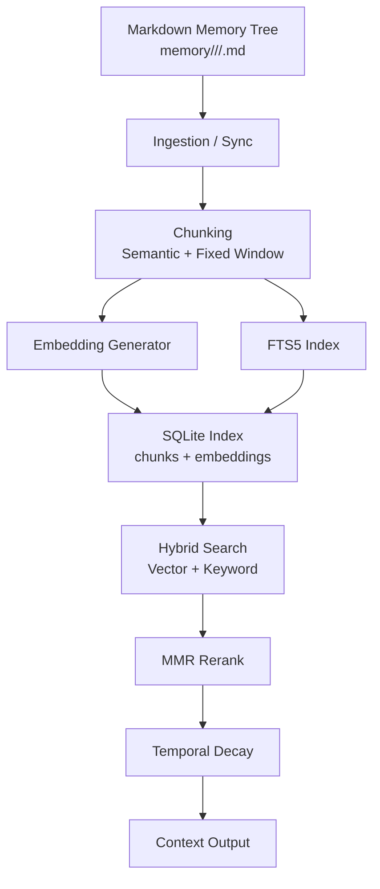
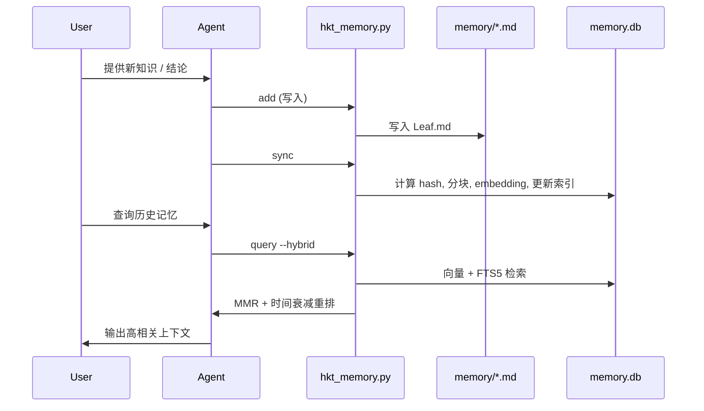

# HKT-memory v2 版本更新说明（OpenClaw 对齐版）

## 一句话亮点

HKT-memory v2 与 OpenClaw 记忆系统同宗同源、架构一致、能力一致：Markdown 作为真实记忆源，SQLite 作为索引层，混合检索、MMR、时间衰减全部齐备。

## 核心更新

- 架构对齐：Markdown 记忆库作为 Source of Truth，SQLite 索引作为检索层（FTS5 + Vector）。
- 混合检索：向量语义 + 关键词检索加权融合（Weighted Sum）。
- 高质量排序：MMR 多样性重排 + Temporal Decay 时间衰减。
- 增强分块：结构化语义分块（Title + List Item）+ 固定窗口兜底。
- 本地优先：零外部数据库依赖，全部本地可用，支持本地模型或外部 Embedding。
- 接入方式：引入 Embedding 模型能力，使用外部 Embedding 时需要配置 API Key。

## 与 OpenClaw 一致性说明

- 存储模型一致：Markdown 作为真实数据源，SQLite 作为索引。
- 检索策略一致：Hybrid Search + BM25 + Vector Similarity。
- 排序能力一致：MMR + 时间衰减。
- 数据流一致：Ingestion → Chunking → Embedding → Index → Query → Rerank → Context。

## 架构图（OpenClaw 对齐）



## 记忆存取流程图（Write & Query）




## 使用效果

```bash
(TraeAI-5) ~/work/OP-AI-SPEC-CODING-ENV [0] $ bash .trae/skills/hkt-memory/entry.sh query --hybrid --keyword "embedded key"
Executing Hybrid Search for: 'embedded key'
Initializing OpenAI compatible client with model: embedding-3
Root: hkt记忆系统 | Branch: 向量化与混合检索
  Leaf: leaf-20260227T0429-zhipu-ai-embedding-integration | Title: Zhipu AI Embedding Integration | Status: 现行
    - Implemented EmbeddingClient in .trae/skills/hkt-memory/scripts/embedding_client.py (Score: 0.3576)
    - Implemented VectorStore in .trae/skills/hkt-memory/scripts/vector_store.py with SQLite + FTS5 (Score: 0.3320)
    - Configured Zhipu AI (GLM-4) via init-ai-env.sh (embedding-3) (Score: 0.3303)
    - Verified vector search functionality with Zhipu embeddings (dim=2048) (Score: 0.3263)

Root: hkt记忆系统 | Branch: 工具与脚本
  Leaf: leaf-20260225T0819-当前可用技能列表 | Title: 当前可用技能列表 | Status: 现行
    - 当前生效技能：skill-creator、hkt-memory。 (Score: 0.3411)

Root: hkt记忆系统 | Branch: 检索与披露
  Leaf: leaf-20260225T0606-渐进式披露优化落地 | Title: 渐进式披露优化落地 | Status: 现行
    - 关键词匹配改为不区分大小写，并按命中比例+数量+最新排序 (Score: 0.3123)
    - query 新增关键词命中线索输出，显示命中关键词或兜底: 最新 (Score: 0.2984)

Root: hkt记忆系统 | Branch: 验收与测试
  Leaf: leaf-20260227T0534-phase-3-4-任务完成-集成-e2e测试与维护工具 | Title: Phase 3 & 4 任务完成：集成、E2E测试与维护工具 | Status: 现行
    - Phase 3: 优化 Embedding Client，增加 30s 超时与 3 次重试机制，解决网络波动问题 (Score: 0.3118)
    - Phase 3: 集成 Zhipu AI Embedding，通过 E2E 验证 Hybrid Search 检索链路 (Score: 0.2959)

Root: hkt记忆系统 | Branch: 检索与披露
  Leaf: leaf-20260227T0542-hkt-memory-混合检索升级需求 | Title: HKT-Memory 混合检索升级需求 | Status: 现行
    - 分块增强：增加固定窗口分块兜底 (Score: 0.3091)
    - 新增特性：MMR (lambda=0.7), Temporal Decay (half_life=30d) (Score: 0.3055)
    - 目标：引入 Weighted Hybrid Search, MMR, Temporal Decay (Score: 0.2948)
    - 算法变更：RRF -> Weighted Sum (Score: 0.2913)

Root: hkt记忆系统 | Branch: 工具与脚本
  Leaf: leaf-20260225T0644-skill-md-精简 | Title: SKILL.md 精简 | Status: 现行
    - 同步更新仓库版、.trae 与 .claude 版本 (Score: 0.3064)
    - 精简 hkt-memory 的 SKILL.md，保留使用场景、强制规则、渐进式检索原则、存储结构简述与常用命令 (Score: 0.3030)

Root: hkt记忆系统 | Branch: 向量化与混合检索
  Leaf: leaf-20260227T0437-phase-2-任务完成-向量存储与混合检索实现 | Title: Phase 2 任务完成：向量存储与混合检索实现 | Status: 现行
    - 已完成 vector_store.py 开发，集成 SQLite + JSON Embedding + FTS5 全文索引 (Score: 0.3055)

Root: hkt记忆系统 | Branch: 工具与脚本
  Leaf: leaf-20260225T0728-skill-md-保留必要信息并恢复-schema | Title: SKILL.md 保留必要信息并恢复 Schema | Status: 现行
    - 同步更新仓库版、.trae 与 .claude 版本 (Score: 0.2953)

Root: hkt记忆系统 | Branch: 检索与披露
  Leaf: leaf-20260225T0550-查询兜底叶子展开 | Title: 查询兜底叶子展开 | Status: 现行
    - 新增 --strict-keyword 可恢复严格匹配 (Score: 0.2942)
    - query 在关键词无匹配时默认继续展开 Leaf，避免只停留在 Branch (Score: 0.2898)

Root: hkt记忆系统 | Branch: 格式与约束
  Leaf: leaf-20260225T0742-恢复记忆文档模板 | Title: 恢复记忆文档模板 | Status: 现行
    - 在 SKILL.md 中补回记忆文档模板块，确保字段一致性与可追溯性 (Score: 0.2925)

```
