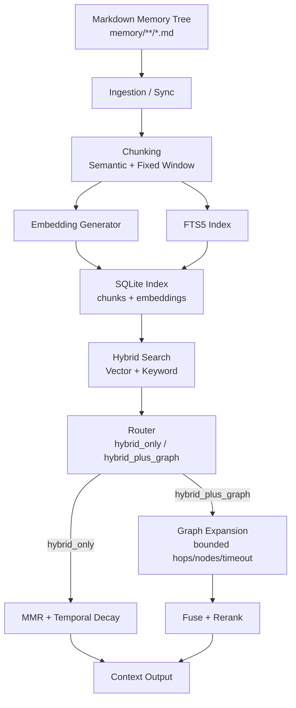
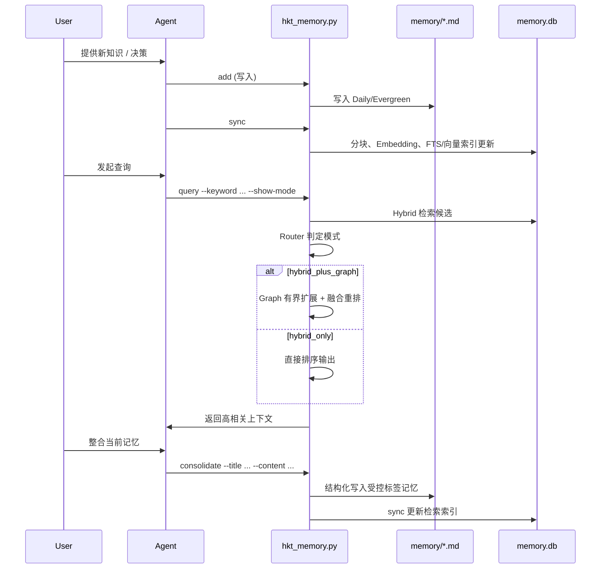

# HKT-memory v3 版本更新说明（Hybrid + Graph Routing 对齐版）

## 一句话亮点

HKT-memory v3 在 v2 的混合检索基座上，新增 Query Routing 与按需 Graph 扩展能力：简单问题走 `hybrid_only`，复杂多跳/因果问题自动升级 `hybrid_plus_graph`，同时引入结构化记忆整合（consolidate）能力，检索更稳、上下文更准、记忆沉淀更规范。

## 核心更新

- 智能路由：新增 Query Router，基于 token 规模、实体密度、低分比例、因果关键词自动判定检索模式。
- 图扩展增强：从 Hybrid 候选种子按关系分数和查询重叠做有界扩展，支持超时控制与最大扩展节点限制。
- 融合策略升级：Hybrid 结果与 Graph 扩展结果做去重融合（取高分）并统一排序输出。
- 可观测性增强：`query` 新增 `--show-mode`，可直接看到当前模式是 `hybrid_only` 还是 `hybrid_plus_graph`。
- 结构化沉淀：新增 `consolidate` 子命令，支持 `kind/scope/status/topic` 四层受控标签、自动映射与阈值校验。
- 兼容与可控：默认开启 routing 与 graph，可通过 `--no-routing` / `--no-graph` 一键降级回纯 Hybrid。

## 与 OpenClaw 一致性说明（v3）

- 存储模型延续一致：Markdown 为真实记忆源，SQLite 为索引层。
- 检索主链一致：Hybrid Search（Vector + BM25/FTS）+ MMR + 时间衰减。
- 路由思路一致：默认轻量路径，复杂查询按信号升级更强路径。
- 工程策略一致：能力增强同时保持可回滚、可观测、可调参。

## 架构图（v3：Routing + Graph）



## 记忆存取流程图（Write / Query / Consolidate）



## 关键参数默认值（v3）

- Routing：`routing_enabled=true`
- Graph：`graph_enabled=true`
- Router 阈值：`min_token_count=6`、`min_entity_like_tokens=2`、`min_low_score_ratio=0.6`
- Graph 控制：`max_hops=2`、`max_expanded_nodes=20`、`timeout_ms=120`
- Graph 打分：`min_relation_score=0.1`、`relation_weight=0.35`、`query_overlap_weight=0.2`
- Hybrid 基线：`vector_weight=0.7`、`text_weight=0.3`、`mmr_lambda=0.7`、`decay_days=30`

## 使用效果

```bash
(TraeAI-5) ~/work/OP-AI-SPEC-CODING-ENV [0] $ python3 hkt-memory/scripts/hkt_memory.py query --keyword "为什么 routing 会触发 graph 扩展" --limit 5 --show-mode
Initializing OpenAI compatible client with model: embedding-3
  Base URL: https://open.bigmodel.cn/api/paas/v4/
Mode: hybrid_plus_graph

[0.3957] hkt记忆系统/验收与测试/leaf-20260227T0534-phase-3-4-任务完成-集成-e2e测试与维护工具.md:None-None
Phase 3 & 4 任务完成：集成、E2E测试与维护工具 Phase 4: 实现 Pruning 自动同步机制，删除过期记忆后自动更新 Vector Store
Source: hkt记忆系统/验收与测试/leaf-20260227T0534-phase-3-4-任务完成-集成-e2e测试与维护工具.md

[0.3449] 2026-03-05.md:1-36
# Daily Memory: 2026-03-05  ### Hybrid先行+按需Graph扩展需求与方案草案 ...
Source: 2026-03-05.md
```

## 升级价值总结

- 对简单查询：延续 v2 低成本高稳定输出。
- 对复杂查询：自动拉起图扩展，提升跨片段关联召回。
- 对长期演进：consolidate 让“对话结论 → 结构化记忆”形成闭环。
- 对生产运维：默认增强、随时降级、参数可调，便于灰度与回归。
