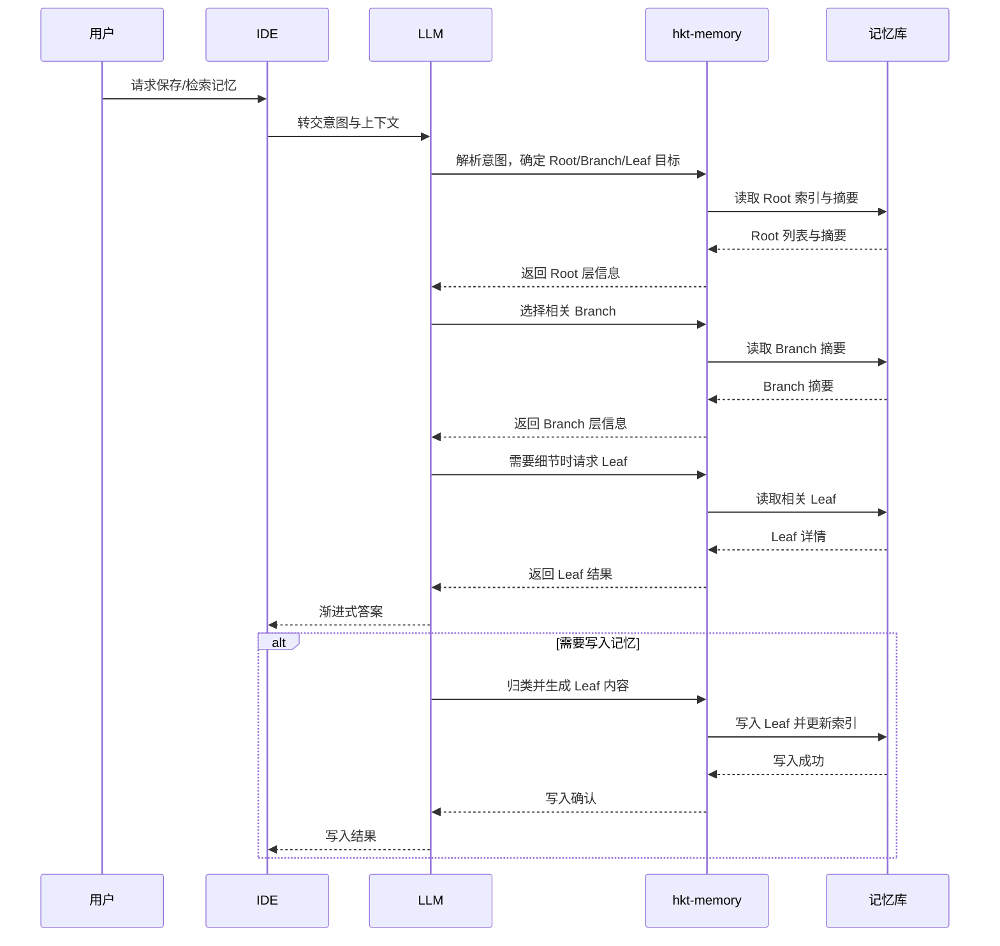

# HKT 渐进式披露记忆设计说明

## 设计目标

- 让记忆以“先粗后细”的方式被检索与展开，避免一次性加载过多上下文
- 以稳定的树状结构组织信息，保证长期可用与可追溯
- 支持主动发现：先看概要，再决定是否深入到细节

## 渐进式披露原理

渐进式披露将记忆分为 Root、Branch、Leaf 三层：

- Root：长期稳定的高层主题或原则
- Branch：Root 下的单一语义分支
- Leaf：具体事实、案例或结论

检索时按层级逐步展开：

1. 只读取 Root 的摘要与索引
2. 如果需要更细粒度信息，再读取相关 Branch 摘要
3. 只有在明确需要细节时才读取 Leaf

这样既保证回答准确，又控制上下文负载。

## 记忆存储结构（Tree）

```text
memory/
├─ index.md
├─ HKT记忆系统/
│  ├─ index.md
│  ├─ 存储结构/
│  │  ├─ index.md
│  │  └─ leaf-20260224-1001-storage-structure.md
│  ├─ 检索与披露/
│  │  ├─ index.md
│  │  └─ leaf-20260224-1030-progressive-query.md
│  └─ 工具与脚本/
│     ├─ index.md
│     └─ leaf-20260224-1105-cli-usage.md
└─ 项目规范/
   ├─ index.md
   └─ 记忆写入策略/
      ├─ index.md
      └─ leaf-20260224-1130-write-policy.md
```

Leaf 文档最小字段：

```text
id: <leaf-id>
title: <简短标题>
status: <现行|过期>
confidence: <高|中|低>
scope: <适用范围>
created_at: <ISO8601>
source: <对话轮次或文件路径>
content:
  - <要点1>
  - <要点2>
```

## 写入与检索流程（时序图）



## 使用样例

首次使用（自然语言对 IDE）：

```text
使用 hkt-memory 分析本项目所有代码并储存关键记忆。
优先建立 Root 与 Branch 的摘要，再把核心结论写入 Leaf。
```

命令式示例（可选）：

```bash
python .trae/skills/hkt-memory/scripts/hkt_memory.py init
python .trae/skills/hkt-memory/scripts/hkt_memory.py add \
  --root HKT记忆系统 \
  --branch 存储结构 \
  --title "项目记忆目录结构" \
  --content "memory/index.md 作为 Root 索引" \
  --source "conversation-2026-02-24"
```
